# 📊 Steam Database Analysis

## 🎯 Overview
Analysis of my steam dataset from the Steam Web API examining game popularity, pricing trends, genre performance, and developer output to understand what drives success on the platform.

It is important to remember that only the top 1,000 titles on Steam by concurrent player count were collected for this dataset.

A summary of the analysis can be seen here: https://langstonstewart.github.io/steam_dataset_analysis/

## 💼 Business Questions
Out of the current top 1000 titles:
1. **Game Popularity:** Which games have the most players on Steam?
2. **Free vs. Paid:** How do free-to-play and paid games compare in concurrent player counts?
3. **Genre Trends:** Which genres attract the most players?
4. **Release Trends:** When were the most games released, and which recent titles are performing best?
5. **Pricing Over Time:** How have game prices changed from year to year?
6. **Review Performance:** Which games are the most reviewed and best rated?
7. **Developer Output:** Which developers have published the most games?

## 🛠️ Analysis Approach

### 1. Steam Games by Popularity
- Ranked all games on Steam by their concurrent player count (Late-July of 2026)
- Filtered out entries with no player count data
- Returned the top 25 most-played games on the platform

Query: [1_steam_games_by_popularity.sql](sql/1_steam_games_by_popularity.sql)

**Visualization:**

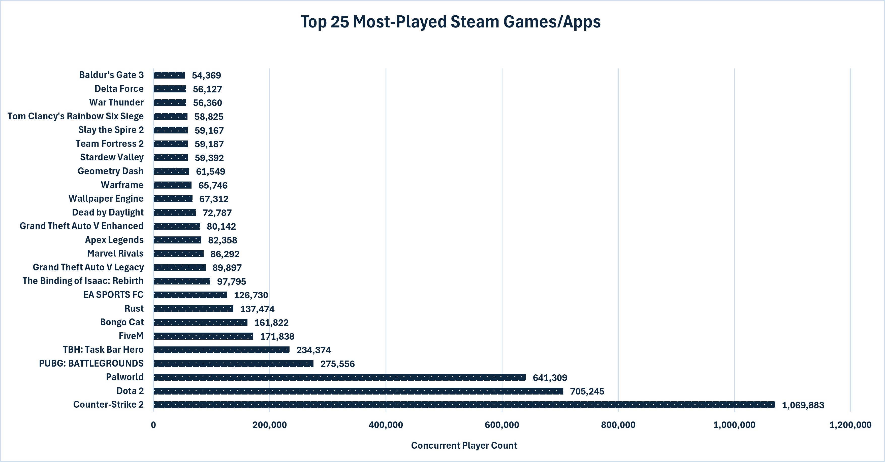

[View Interactive Chart...](html_charts/1_steam_games_by_popularity.html)

**Key Findings**

- A small handful of titles completely dominate player counts; the top games surpass the majority of the list by a wide margin.
- Free-to-play games seem to be heavily represented, suggesting that the price barrier possibly plays a major role in peak player counts.
- Legacy titles like Counter-Strike 2 and Dota 2 still hold dominant positions despite being older titles (1998 and 2013), showing the strength of established competitive games.

**Business Insights**
- New releases face a steep climb to reach popularity. Marketing and community-building from launch day are critical; Palworld seems to have succeeded from this, launching near the collection of this dataset and still maintaining most players the following month.
- The longevity of top titles suggests that live-service features, consistent content updates, and competitive ecosystems are the most reliable path to sustained player counts.

---

### 2. Free-to-Play vs. Paid Games
- Pulled the top 15 free-to-play and top 15 paid games by player count
- Combined both sets into a single ranked comparison of 30 games
- Calculated average player counts for each pricing model

Query: [2_ftp_vs_ptp_games.sql](sql/2_ftp_vs_ptp_games.sql)

**Visualizations:**

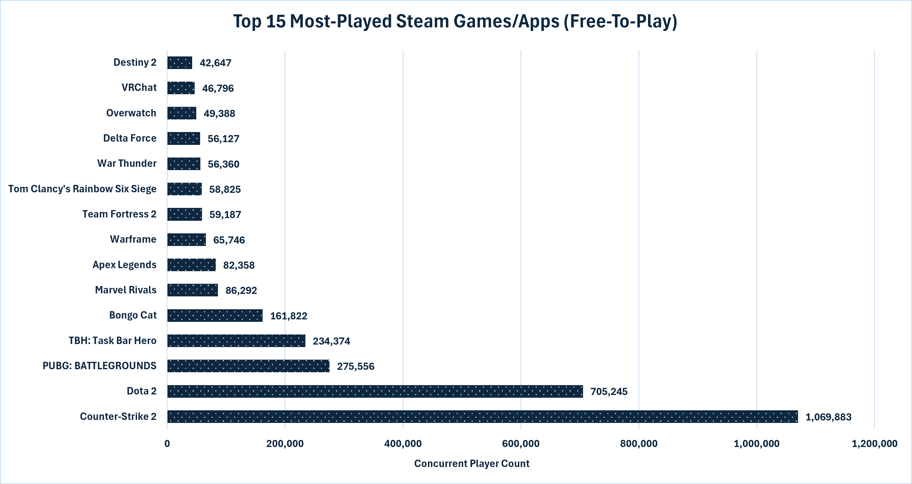
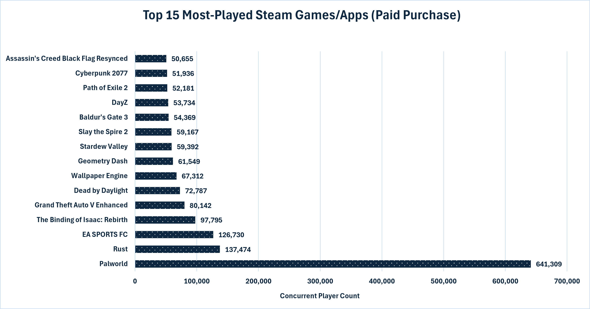
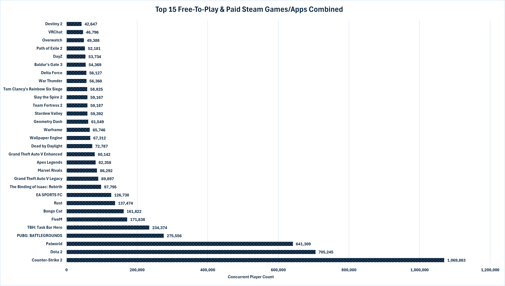
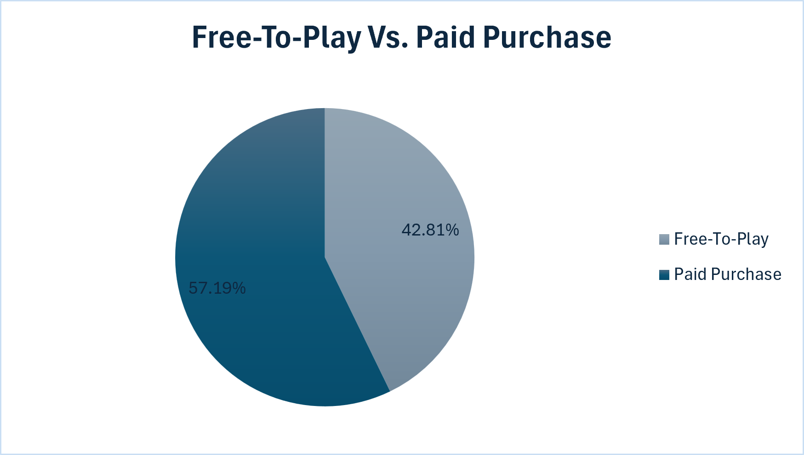

[View Interactive Chart...](html_charts/2_top_free_vs_paid.html)

**Key Findings**

- Free-to-play titles account for the majority of the highest player counts in the combined top-30 list.
- The top paid games still attract massive audiences, but their numbers are lower than the leading free titles.
- The average player count for free-to-play games is significantly higher than for paid games, likely due to the low entry barrier.

**Business Insights**
- For developers aiming for a high concurrent player count, a free-to-play model with in-game monetization is clearly the more dominant approach.
- Paid games can still succeed at scale, but they tend to rely on strong brand recognition, franchise reception, or strong audience loyalty.

---

### 3. Genre Popularity
- Aggregated total player counts by genre
- Filtered out games with no genre or player count data
- Ranked genres from most to least popular by total player count

Query: [3_most_played_genres.sql](sql/3_most_played_genres.sql)

**Visualization:**

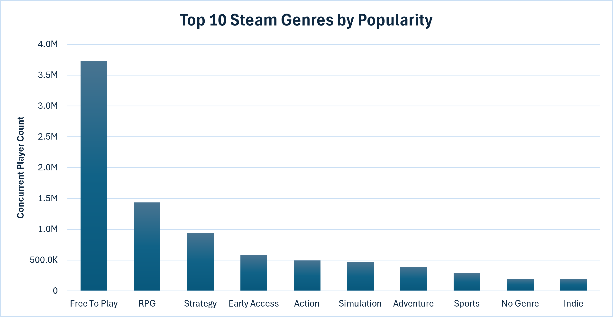

[View Interactive Chart...](html_charts/3_genre_popularity.html)

**Key Findings**

- Free-To-Play is the dominant genre by concurrent player count, over more than double the later genre (RPG).
- Strategy and Action seem to have a generous following, suggesting that other multiplayer-adjacent genres are also valued by players.
- Niche genres such as Game Development and Video Production trail significantly behind, confirming that genre choice has a meaningful impact on potential audience size.

**Business Insights**
- Developers targeting the widest possible audience should prioritize genres with proven mass appeal, particularly Action or Strategy.
- As proven before, a Free-To-Play title is a guaranteed way to pull players; Launching a title in Early Access can also make players feel more special and seek a way to play.
- Niche genres can still be commercially viable but require targeted marketing rather than relying on broad discoverability. A strong reliable brand known for titles like these wouldn't need to worry.

---

### 4. Game Release Trends
- Counted the number of games released each year
- Identified the peak year for new releases
- Pulled the top 15 most-played games released in 2025 (leading year)

Query: [4_year_with_most_game_releases.sql](sql/4_year_with_most_game_releases.sql)

**Visualizations:**

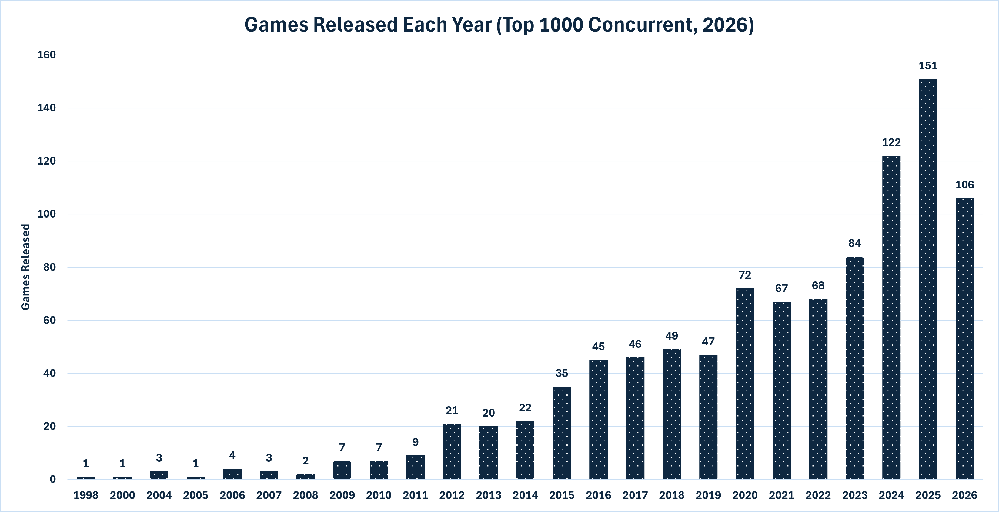
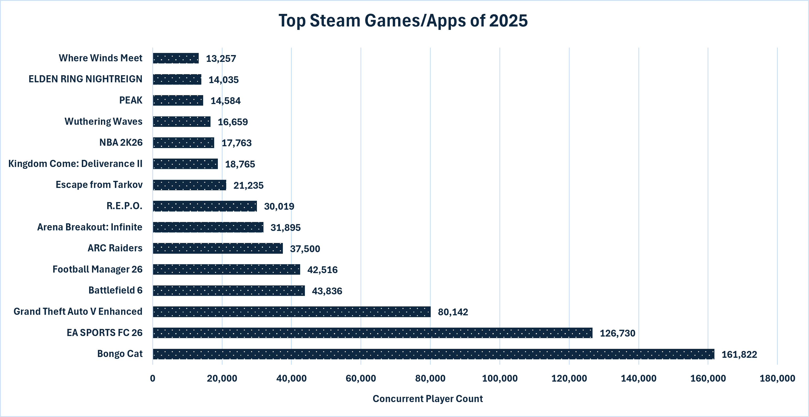

[View Interactive Chart...](html_charts/4_game_release_trends.html)

**Key Findings**

- Top Game releases on Steam have grown dramatically over each year, with recent years hitting record highs in new titles published.
- The sheer volume of new releases means individual games face more competition for visibility than ever before.
- Among 2025 releases, a small number of titles show high player counts, succeeding to hold a dedicated community of players.

**Business Insights**
- The growing flood of new releases makes discoverability quite the challenge; launch-day wishlists and early community building are more important than ever.
- Standing out in an oversaturated catalog requires a clear difference in genre, art style, gameplay, or marketing approach.

---

### 5. Game Prices by Year
- Calculated the average price of paid games for each release year
- Tracked year-over-year percent change in average price
- Filtered to only include games with a valid price and release date

Query: [5_game_prices_by_year.sql](sql/5_game_prices_by_year.sql)

**Visualization:**

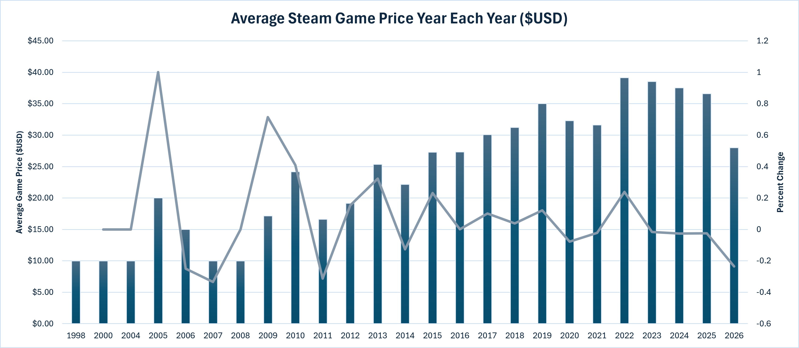

[View Interactive Chart...](html_charts/5_game_prices_by_year.html)

**Key Findings**

- Average game prices have trended upward over the years, with recent releases commanding higher price points than older titles.
- There are notable year-over-year spikes in average price, likely reflecting shifts in the types of games being released in those years.
- Early years show lower average prices, consistent with a period when lower-budget titles dominated the catalog.

**Business Insights**
- The market has gradually accepted higher price points, giving developers of premium titles more room to price competitively without sacrificing conversions.
- Year-over-year price volatility suggests that market conditions and release composition (AAA vs. indie) heavily influence what price the market will bear.

---

### 6. Most Reviewed Games
- Identified the top 25 games by total review count
- Calculated a positive review score (percentage of reviews that are positive) for each
- Re-sorted the same set by positive review score to surface the best-rated titles

Query: [6_most_reviewed_games.sql](sql/6_most_reviewed_games.sql)

**Visualizations:**

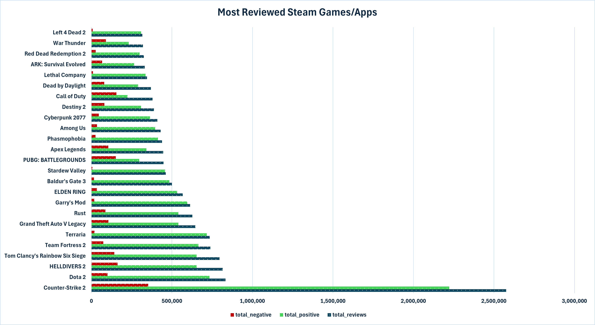
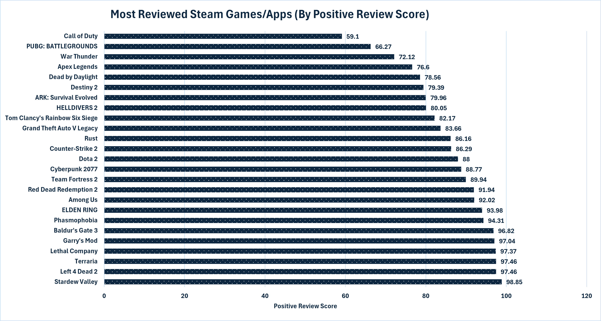

[View Interactive Chart...](html_charts/6_most_reviewed_games.html)

**Key Findings**

- The most-reviewed games are almost exclusively long-running, high-popularity titles — review volume closely mirrors player count at the top.
- When re-sorted by positive review score, the ranking shifts considerably; some of the highest-reviewed games do not hold the best ratings, and vice versa.
- Several titles maintain very high positive review scores (above 90%), indicating both widespread popularity and strong player satisfaction.

**Business Insights**
- Review score and review volume are distinct signals. High volume indicates reach; high positive score indicates quality perception.
- Games with both high volume and high positive scores represent the industry gold standard and are the clearest models for long-term success.
- A game with many reviews but a mediocre positive score signals a reachable but dissatisfied audience — a potential opportunity for a competitor that addresses the gap.

---

### 7. Game Count by Developer
- Ranked the top 15 developers by total number of games published on Steam
- Filtered out entries with no developer data

Query: [7_game_count_by_developer.sql](sql/7_game_count_by_developer.sql)

**Visualization:**

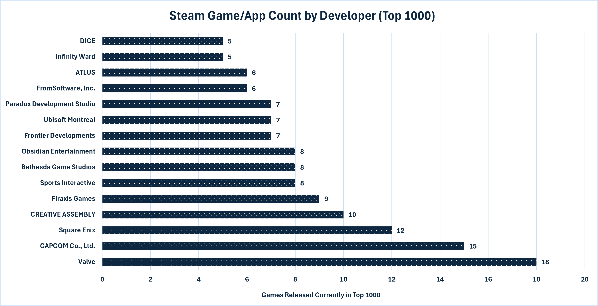

[View Interactive Chart...](html_charts/7_game_count_by_dev.html)

**Key Findings**

- The top developers by game count are prolific studios that publish a high volume of titles rather than focusing on a single blockbuster.
- High game counts don't necessarily translate to high player counts — volume-based publishing is a distinct strategy from blockbuster development.
- Some well-known major studios appear far lower on this list than smaller, more prolific publishers, highlighting different approaches to the market.

**Business Insights**
- A volume strategy can build catalog presence and capture niche audiences across many titles, but each individual title competes for a smaller slice of attention.
- Focusing resources on fewer, higher-quality titles may yield better per-game player counts and review scores, even if overall catalog size is smaller.

---

## 🚀 Strategic Recommendations

1. **Pricing & Monetization**
   - Free-to-play is the dominant model for maximizing player acquisition. Developers targeting peak concurrent players should evaluate this model thoroughly.
   - For paid titles, the market has gradually moved toward accepting higher price points — premium pricing is viable for games with strong quality signals and marketing.

2. **Genre & Market Positioning**
   - RPGs, Strategy, and Action attract the largest total audience on Steam by a significant margin. Developers should consider how their game fits into or differentiates within these categories.
   - Niche genres can be profitable but require a tight and targeted audience rather than broad discovery campaigns.

3. **Release & Discoverability**
   - With record numbers of games releasing each year, launch-day momentum (wishlists, press coverage, community) is the most critical factor in breaking through.
   - Games without a strong pre-launch presence are increasingly likely to be buried in the catalog months after release.

4. **Quality & Reviews**
   - Positive review scores above 90% are achievable even for indie games. Quality and player satisfaction remain important factors after a game's launch.
   - Games with large review volumes but low scores represent market gaps where a well-executed competitor could capture a dissatisfied audience.

5. **Developer Strategy**
   - Volume publishing builds catalog presence but dilutes per-title investment. Focused development on fewer titles tends to produce better individual performance metrics.

## What Makes a Steam Title Special?
With all metrics considered, a successful Steam title requires a dedicated player base; either a Free-To-Play approach or a paid title with a generously inviting amount of game content. A title that can create an entirely different gameplay experience in comparison to its competitors will surely dominate within the market.

## ⚙️ Technical Details
- Database: PostgreSQL
- Analysis Tools: PostgreSQL, pgAdmin, DBeaver
- Data Collection: Steam Web API (custom Python scraper)
- Visualization: Microsoft Excel
- Interactive Charts: Chart.js (HTML/JS)
