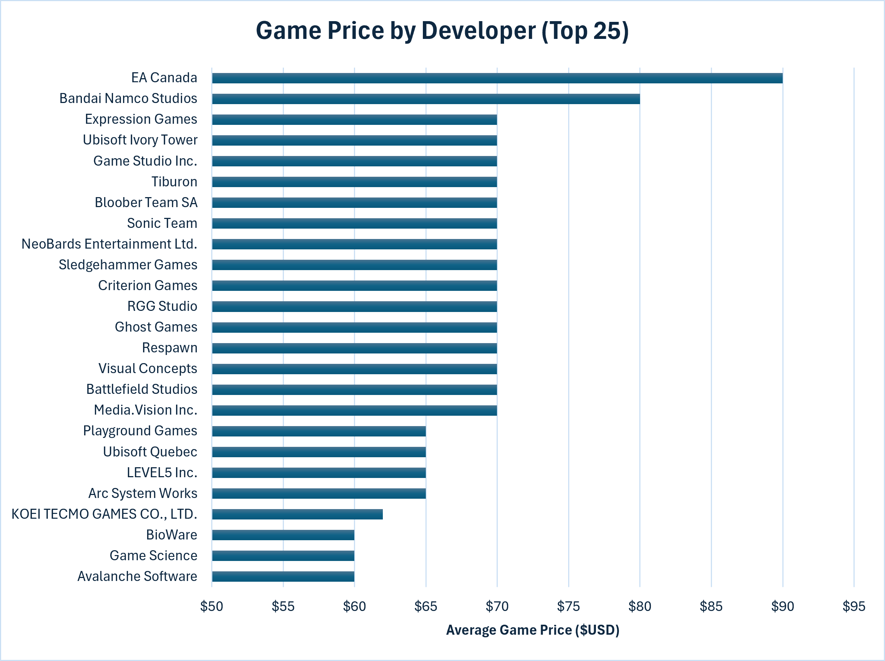

# 📊 Steam Database Analysis

## 🎯 Overview
Analysis of my steam dataset from the Steam Web API examining game popularity, pricing trends, genre performance, and developer pricing to understand what drives success on the platform.

It is important to remember that only the top 1,000 titles on Steam by concurrent player count were collected for this dataset.

A summary of the analysis can be seen here: https://langstonstewart.github.io/steam_dataset_analysis/

## 💼 Business Questions
Out of the current top 1000 titles:
1. **Game Popularity:** Which games have the most players on Steam?
2. **Free vs. Paid:** How do free-to-play and paid games compare in concurrent player counts?
3. **Genre Trends:** Which genres attract the most players?
4. **Release Trends:** When were the most games released, and which recent titles are performing best?
5. **Pricing Over Time:** How have game prices changed from year to year?
6. **Review Performance:** Which games are the most reviewed and best rated?
7. **Developer Pricing:** Which developers command the highest average game prices?

## 🛠️ Analysis Approach

### 1. Steam Games by Popularity
- Ranked all games in the dataset by their concurrent player count (Late-July of 2026)
- Filtered out entries with no player count data
- Returned the top 25 most-played games on the platform

Query: [1_steam_games_by_popularity.sql](sql/1_steam_games_by_popularity.sql)

**Visualization:**

[View Interactive Chart...](html_charts/1_steam_games_by_popularity.html)

**Key Findings**

- A small handful of titles completely dominate player counts; the top games surpass the majority of the list by a wide margin.
- Free-to-play games seem to be heavily represented, suggesting that the price barrier possibly plays a major role in peak player counts.
- Counter-Strike 2 (a 2023 release) and Dota 2 (2013, a long-established title) both hold dominant positions at the top of the list, showing that both a recently refreshed title and a legacy competitive game can command massive concurrent player counts.

**Business Insights**
- New releases face a steep climb to reach popularity. Marketing and community-building from launch day are critical; Palworld seems to have succeeded from this, launching near the collection of this dataset and still maintaining most players the following month.
- The strength of Counter-Strike 2 and Dota 2 suggests that live-service features, consistent content updates, and competitive ecosystems are the most reliable path to sustained player counts, whether a title is new or long-established.

---

### 2. Free-to-Play vs. Paid Games
- Pulled the top 15 free-to-play and top 15 paid games by player count
- Calculated average player counts for each pricing model
- Gathered all player counts into a pie chart based on the games pricing model

Query: [2_ftp_vs_ptp_games.sql](sql/2_ftp_vs_ptp_games.sql)

**Visualizations:**

[View Interactive Chart...](html_charts/2_top_free_vs_paid.html)

**Key Findings**

- Paid games actually hold the majority share of total concurrent players platform-wide (57.19% vs. 42.81% for free-to-play), making paid purchases the overall winner by total player count.
- Free-to-play titles still hold a higher average player count per title, and dominate the very top of the concurrent player list — a small number of massive free-to-play hits pull outsized numbers.
- The top paid games still attract massive audiences, but their peak numbers are lower than the leading free titles.

**Business Insights**
- Paid purchases command the larger overall share of concurrent players on Steam, driven by the sheer volume of paid titles on the platform rather than any single blockbuster.
- Free-to-play is still the stronger model for a single title chasing the highest possible per-title concurrent player count, since the low entry barrier concentrates players into fewer, massive hits.
- Paid games can still succeed, but they tend to rely on strong brand recognition, franchise reception, or strong audience loyalty.

---

### 3. Genre Popularity
- Aggregated total player counts by genre
- Filtered out games with no genre or player count data
- Ranked genres from most to least popular by total player count

Query: [3_most_played_genres.sql](sql/3_most_played_genres.sql)

**Visualization:**

[View Interactive Chart...](html_charts/3_genre_popularity.html)

**Key Findings**

- Free-To-Play is the dominant genre by concurrent player count, over more than double the later genre (RPG).
- Strategy and Action seem to have a generous following, suggesting that other multiplayer-adjacent genres are also valued by players.
- Niche genres such as Game Development and Video Production trail significantly behind, confirming that genre choice has a meaningful impact on potential audience size.

**Business Insights**
- Developers targeting the widest possible audience should prioritize genres with proven mass appeal, particularly RPG or Strategy.
- The chart proves a Free-To-Play title is a guaranteed way to pull players; Launching a title in Early Access can also make players feel more special and seek a way to play.
- Niche genres can still be commercially viable but require targeted marketing rather than relying on broad discoverability. A strong reliable brand known for titles like these wouldn't need to worry.

---

### 4. Game Release Trends
- Summed total concurrent player count for games grouped by release year
- Filtered out entries with no release date
- Calculated year-over-year percent change in total player count from 1998 through 2025

Query: [4_year_with_most_game_releases.sql](sql/4_year_with_most_game_releases.sql)

**Visualization:**

[View Interactive Chart...](html_charts/4_game_release_trends.html)

**Key Findings**

- 2013 and 2023 stand out as massive outlier years in total player count, each driven almost entirely by a single flagship title: Dota 2's 2013 release and Counter-Strike 2's 2023 release each carry the vast majority of their year's total on their own.
- Outside of those two spikes, yearly totals stay comparatively modest through the mid-2010s and early 2020s, since no other single release has matched the scale of those two titles.
- 2025 marks a strong rebound, pushed by newer breakout hits like Bongo Cat and EA Sports FC 26, showing that recent releases can still command serious concurrent player counts even without unseating the top two years.

**Business Insights**
- Total player count by release year is heavily skewed by a handful of blockbuster titles, so year-over-year swings say more about a couple of games' individual performance than the industry's overall release health.
- Recent years (2024-2025) show a renewed ability for new releases to draw large audiences, suggesting strong launches are still very achievable despite an increasingly crowded catalog.

---

### 5. Game Prices by Year
- Calculated the average price of paid games for each release year
- Tracked year-over-year percent change in average price
- Filtered to only include games with a valid price and release date

Query: [5_game_prices_by_year.sql](sql/5_game_prices_by_year.sql)

**Visualization:**

[View Interactive Chart...](html_charts/5_game_prices_by_year.html)

**Key Findings**

- Average game prices have trended upward over the years, with recent releases commanding higher price points than older titles.
- There are notable year-over-year spikes in average price, likely reflecting shifts in the types of games being released in those years.
- Early years show lower average prices, consistent with a period when lower-budget titles dominated the catalog.

**Business Insights**
- The market has gradually accepted higher price points, giving developers of premium titles more room to price competitively without sacrificing conversions.
- Year-over-year price volatility suggests that market conditions and release composition (AAA vs. indie) heavily influence what price the market will bear.

---

### 6. Most Reviewed Games
- Identified the top 25 games by total review count
- Calculated a positive review score (percentage of reviews that are positive) for each
- Re-sorted the same set by positive review score to surface the best-rated titles

Query: [6_most_reviewed_games.sql](sql/6_most_reviewed_games.sql)

**Visualization:**

[View Interactive Chart...](html_charts/6_most_reviewed_games.html)

**Key Findings**

- The most-reviewed games are almost exclusively long-running, high-popularity titles — review volume closely mirrors player count at the top.
- When re-sorted by positive review score, the ranking shifts considerably; some of the highest-reviewed games do not hold the best ratings, and vice versa.
- Several titles maintain very high positive review scores (above 90%), indicating both widespread popularity and strong player satisfaction.

**Business Insights**
- Review score and review volume are distinct signals. High volume indicates reach; high positive score indicates quality perception.
- Games with both high volume and high positive scores represent the industry gold standard and are the clearest models for long-term success.
- A game with many reviews but a mediocre positive score signals a reachable but dissatisfied audience; a potential opportunity for a competitor that addresses the gap.

---

### 7. Game Price by Developer
- Ranked the top 25 developers by average game price
- Filtered out entries with no developer or price data

Query: [7_game_price_by_developer.sql](sql/7_game_price_by_developer.sql)

**Visualization:**

[View Interactive Chart...](html_charts/7_game_price_by_dev.html)

**Key Findings**

- EA Canada and Bandai Namco Studios top the list with average prices near $90 and $80, well above the rest of the field.
- Most of the top-tier developers (in the $65-$70 range) are only tied to a few flagship titles in this dataset, so their average reflects fewer premium releases rather than a sustained studio-wide pricing strategy.
- KOEI TECMO GAMES CO., LTD. is the only developer in that upper tier with multiple titles (5 games) still averaging over $60, a rare case of a prolific studio holding premium pricing across its catalog.

**Business Insights**
- High average prices at the top of this list are mostly a reflection of individual AAA releases, not proof that a developer can command premium pricing across their whole catalog.
- Developers with multiple titles that still sustain a high average price, like KOEI TECMO, show that premium pricing can work as a repeatable strategy rather than a one-off success.
- For developers building a pricing strategy, a single high-profile flagship title can anchor perception, but consistent premium pricing across a catalog requires proven, repeatable quality.

---

## 🚀 Strategic Recommendations

1. **Pricing & Monetization**
   - Free-to-play is the dominant model for maximizing per-title player acquisition. Developers targeting peak concurrent players should evaluate this model thoroughly.
   - Paid titles still command the majority of total concurrent players platform-wide due to sheer volume, so a paid model remains a viable path when paired with strong brand recognition or franchise reception.
   - For paid titles, the market has gradually moved toward accepting higher price points — premium pricing is viable for games with strong quality signals and marketing.

2. **Genre & Market Positioning**
   - RPGs, Strategy, and Action attract the largest total audience on Steam by a significant margin. Developers should consider how their game fits into or differentiates within these categories.
   - Niche genres can be profitable but require a tight and targeted audience rather than broad discovery campaigns.

3. **Release & Discoverability**
   - With record numbers of games releasing each year, launch-day momentum (wishlists, press coverage, community) is the most critical factor in breaking through.
   - Games without a strong pre-launch presence are increasingly likely to be buried in the catalog months after release.

4. **Quality & Reviews**
   - Positive review scores above 90% are achievable even for indie games. Quality and player satisfaction remain important factors after a game's launch.
   - Games with large review volumes but low scores represent market gaps where a well-executed competitor could capture a dissatisfied audience.

5. **Developer Pricing Strategy**
   - Premium average prices at the top of the developer list are often driven by a single flagship release rather than catalog-wide pricing power; developers shouldn't assume one high-profile title proves broader pricing strength.
   - Studios like KOEI TECMO GAMES CO., LTD. show that sustaining a premium average price across multiple titles is possible, but rare, and requires consistent quality across a catalog.

## What Makes a Steam Title Special?
With all metrics considered, a successful Steam title requires a dedicated player base; either a Free-To-Play approach or a paid title with a generously inviting amount of game content. A title that can create an entirely different gameplay experience in comparison to its competitors will surely dominate within the market.

## ⚙️ Technical Details
- Database: PostgreSQL
- Analysis Tools: PostgreSQL, pgAdmin, DBeaver
- Data Collection: Steam Web API (custom Python scraper)
- Visualization: Microsoft Excel
- Interactive Charts: Chart.js (HTML/JS)
